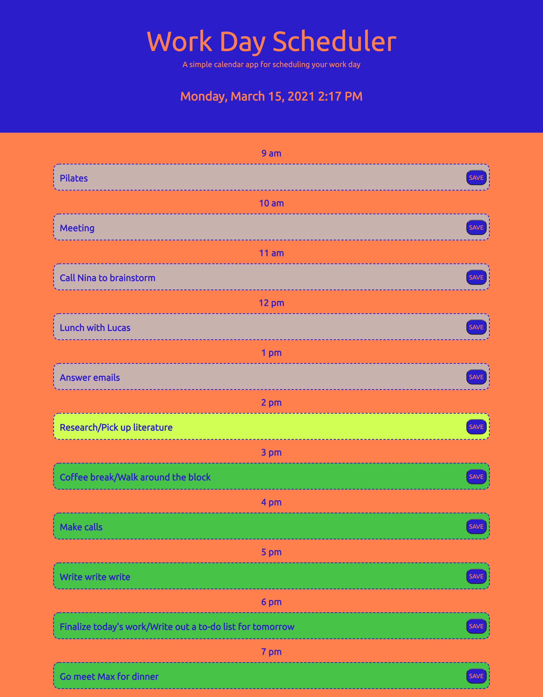

# Work-Day-Scheduler

GOAL: 

The goal of this project was to complete the creation of a Work Day Scheduler with specific features. For this, I was given some starter code in HTML and CSS files. 

By writing some JavaScript code as well as adding to/editing the existing code, these features were to be included in the Work Day Scheduler webpage:

--> When the user opens the daily planner, the current date should be displayed on top;
--> When the user scrolls down, they see timeblocks for every hour of their work day;
--> Each timeblock is color-coded to reflect whether each time slot is in the past, present, or future;
--> When the user clicks into a timeblock, they are allowed to enter an event;
--> Atached to each timeblock is a save button, and when the user clicks this button, the information entered gets saved in local storage;
--> If the page is refreshed, the information entered and saved the previous time continues to show on the webpage.

In order to handle date and time components for this webpage, I was to use the Moment.js API, and the page was to be powered by jQuery. 

This is an image of the final webpage:

PROCESS: 

The first thing I did in order to start tackling this project was to organize all existing starter code into a folder in VS Code, open the HTML in my browser, and study all of the code carefully. I quickly noticed that there were some clues left in the code, which indicated in which direction I should go. For example, there was an instruction line in the HTML indicating where the code for the timeblocks should go. I also noticed that, in the CSS code, there were some class names present that were yet to be used in the HTML or anywhere else. At this point, I also made sure that all relevant relative paths were in place, and added the script.js relative path to the HTML.  

After this, I drew out on paper a simple mock-up of how I wanted the webpage to look, and wrote notes on the desired functionality of each section. This gave me a better idea of what type of code I would need for style and functionality. 

To get acquainted with the existing code and start in a simple way, I focused on styling the webpage. For this, I added some styling to CSS, but also edited some things that were already there, such as colors and fonts. This also helped in my brainstorming of the logic that would eventually go in the newly created JavaScript file, which would make the daily planner dynamic. 

The next step was to thoroughly look through the specifications once again, and break them down into pseudo-code in JavaScript. 

I then started working on the JavaScript/jQuery code, completing each task in the pseudo-code from top to bottom. 

The first task was to add the current date (and evetually I also added the current time) to the top of the page. This was done in the JavaScript file by using both jQuery and Moment.js. 

The next step was much longer and complex. Here I created the timeblocks in HTML, by using Bootstrap Grid features. Besides creating the actual blocks and displaying the work hours with each one, I also started playing around with adding input and button elements to each one. This took some trial and error, specifically in the placement of each section in relation to the other. The final result came from adjusting sizes and styles in CSS, as well as reading through relevant documentation to try to find the optimal syntax for this type of code.

The next step was to focus on the functionality of the save button for each time slot. I jotted down on paper some ideas for what this logic would look like. I quickly realized that the button's main function was not to simply finalize the user's decision on the event input for a timeblock, but also to add this information to the browser's local storage and make sure that this information was rendered on the webpage when it was refreshed. 
This step required me to add unique IDs to each input and corresponding button element. I queried these IDs into JavaScript, and used them to create event listeners for each button. The instruction for each listener was to save the input information in local storage, and then separate functions were created to render this information back onto the page when it was reopened or refreshed. 

The last major step in this process was to figure out a way to make sure that the backgrounds of the input fields changed in relation to the current time of the day. I knew this would require the usage of the Moment.js API once again, but this took some extra research and mental juggling. I went back to mapping things out on paper to help me look at the possibilities. In studying the Moment.js documentation, I realized that the current time could be shown as a number from 0-23, which allowed me to create conditionals. These conditions stated what should happen to the background of each input field/timeblock dependent on the current time, and different colors were assigned for timeblocks that were in the past, present, or future. 

The very last step, as usual, was to look over the code in order to clean it up and make sure there wasn't anything superfluous in the semantics, as well as test the Work Day Scheduler webpage several times in order to make sure that it was working correctly. 

CHALLENGES/IMPROVEMENTS: 

This project was especially interesting because circumstances made it so I had a lot less time to complete it, compared to past projects. Because of this, I could not walk away from it as often, which usually allows me to clear my head and get a better understanding of what the next steps are. I was therefore forced to really dive into the documentation when I got stuck or confused, and played around with changing the code more often, until it did what I wanted it to. 

Fortunately, I found ways around any bugs or blocks I encountered in the time allotted. That being said, I think that there are probably better ways of organizing this code, both semantically and dynamically. It seems "wordy", and could probably be consolidated. I eventually focused on the desired functionality, and less on how I got there. This also resulted in me getting away from jQuery and, instead, using vanilla JavaScript, with which I am more familiar at this time. I think I understand jQuery generally, and the documentation is extensive, but my code was simply not working when I used it in most instances. Once I switched over to vanilla JavaScript syntax, things started to function correctly. 

Given more time, I would try to incorporate jQuery fully into the script file, for consistency. I would also look into better ways of organizing lengthy, repeated portions of code. I would also try to incorporate certain elements to the daily planner that were not asked for in the acceptance criteria. One of these things would be to make sure that, when the day changes, the input fields are cleared, so the user could plan their current work day without having to manually change or clear the previous day's events. Of course the addition of a way to scroll through different days would be useful, but again, this would be outside of the scope of this assignment. 

Here is a live link to the Work Day Scheduler webpage: 

https://mgdelneri.github.io/Work-Day-Scheduler/

